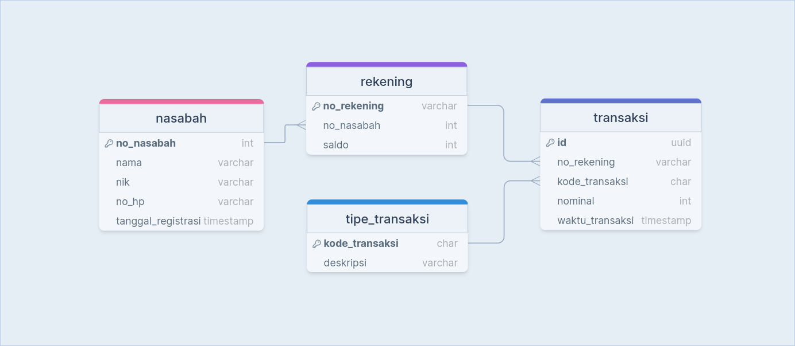

# REST API Bank dengan gofiber

Repository ini adalah sebuah REST API sistem bank simpel yang dibuat dengan menggunakan Golang.

## API Spec

| ROUTE                 | HTTP METHOD | REQUEST PAYLOAD                                    | RESPONSE                                                 |
| --------------------- | ----------- | -------------------------------------------------- | -------------------------------------------------------- |
| /daftar               | POST        | { "nama": string, "nik": string, "no_hp": string } | { "success": string, "data": { "no_rekening": string } } |
| /tabung               | POST        | { "no_rekening": string, "nominal": integer }      | { "success": string, "data": { "saldo": integer } }      |
| /tarik                | POST        | { "no_rekening": string, "nominal": integer }      | { "success": string, "data": { "saldo": integer } }      |
| /saldo/{no_rekening}  | GET         |                                                    | { "success": string, "data": { "saldo": integer } }      |
| /mutasi/{no_rekening} | GET         |                                                    | { "success": string, "data": { "data": array } }         |

## Rancangan database

desain database menggunakan [drawsql.app](https://drawsql.app/teams/rh142/diagrams/isi-backend-assessment)


## Cara penggunaan

### Buat config.env file di dalam folder `internal`

buat file `config.env` yang akan menyimpan environment variabel di root folder project:

```
SERVICE=BANK

DB_HOST=localhost
DB_PORT=5432
DB_USER=DBUSER
DB_PASSWORD=DBPASSWORD
DB_DATABASE=DB
DB_DRIVER=postgres

SERVICE_HOST=localhost
SERVICE_PORT=2525
```

atau dapat dilihat pada `.env.sample`

### Init database

jalankan query yang terdapat pada file `init.sql`

### Jalankan `go mod download`

buka terminal dan jalankan `go mod download`

### Jalankan API service

buka terminal dan pastikan sudah berada di folder `internal`  
kemudian jalankan `go run main.go`
